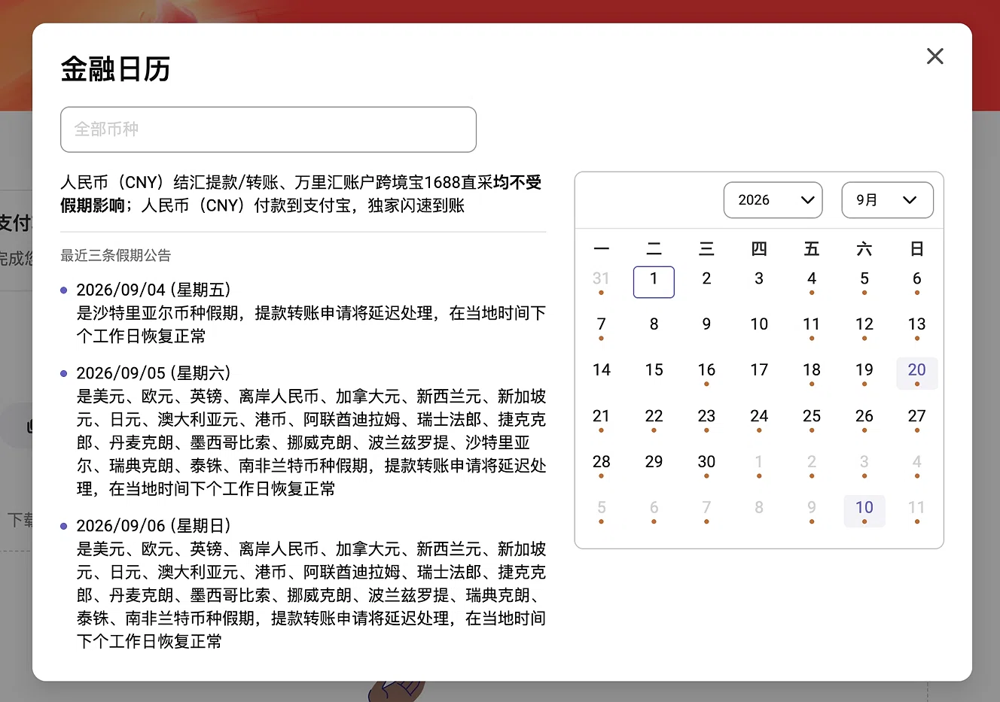
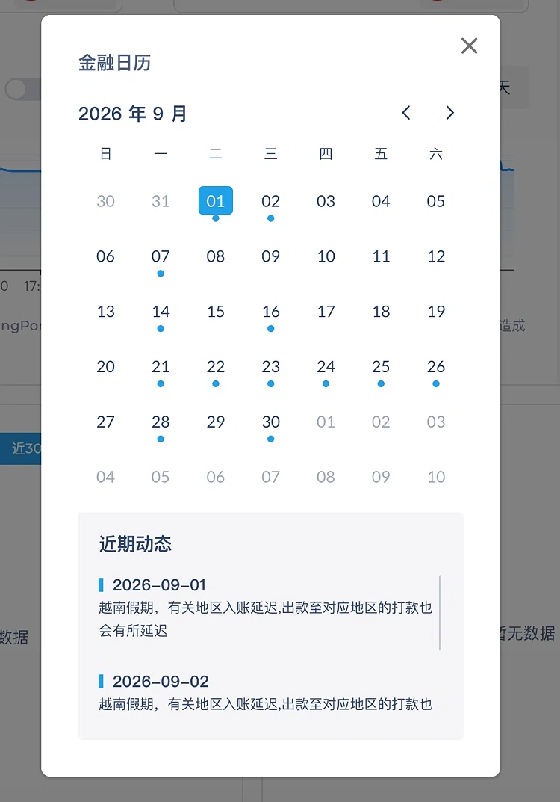

# V1.0-金融日历-PRD

## 0. 文档信息

| 项 | 内容 |
| --- | --- |
| 产品名称 | 金融日历（Financial Calendar） |
| 版本 | V1.0（基础版） |
| 文档类型 | PRD（产品需求文档） |
| 关联文档 | [V1.0-日历基础搭建-BRD](../BRD/V1.0-日历基础搭建/V1.0-日历基础搭建-BRD.md)、[V1.0-日历基础搭建-原型线框图](./V1.0-日历基础搭建-原型线框图.md) |
| 评审状态 | 已评审（Q1–Q9 关键决策已确认） · 待开发 |
| 更新日期 | 2026-10-03 |

> **阅读须知**：本产品由 BRD 细化而来。原 BRD 中的 9 项待确认问题（Q1–Q9）已在评审中**全部确认**，结论见第 12 章「已确认决策」，作为 V1.0 冻结基线。配套原型线框图见 [V1.0-日历基础搭建-原型线框图](./V1.0-日历基础搭建-原型线框图.md)。

---

## 1. 背景与目标

### 1.1 业务背景（源自 BRD）

跨境卖家在做跨境支付/提款时，若遇目标银行或清算机构放假，资金将延迟到账，可能造成供应商断货、错过平台大促、信用卡还款逾期或汇率损失。当前行业内的做法（见竞品截图）只是罗列「币种 + 假期 + 延迟说明」，属于**信息展示**而非**决策辅助**。

### 1.2 产品定位

金融日历不只是「查日期的工具」，而是「**资金流转风险管理与备货规划助手**」。核心是把「节假日信息」转化为「**业务影响 + 行动建议**」。

### 1.3 V1.0 产品目标

1. 用户能在一个日历里，**5 秒内**判断某个日期对自己关注的币种是否存在结算延迟风险。
2. 用户能提前看到**电商大促节点**，并据此规划备货与结汇窗口。
3. 日历以 **SDK 形式交付**，可被 EOS 等系统嵌入，同时提供一个**可独立访问的页面**。

### 1.4 V1.0 非目标（Non-Goals）

以下明确**不在 V1.0 范围**，避免范围蔓延：

- 不做 Push 推送提醒（归 V2.0，见 Q9）。
- 不做实时汇率、汇率波动预测。
- 不做「一键提款 / 提前锁汇」等交易动作（归 V3.0）。
- 不做 EOS 后台可视化管理界面（V1.0 仅做数据配置能力预留 + 接口预留）。
- 不做智能路由建议（如「美元假期改用 CNY 直采」）。
- 不做精确到分钟的 Cut-off Time 提示（V1.0 只给「延迟 N 个工作日」结论，精确时间归 V1.1，见 Q3）。

---

## 2. 名词解释

| 术语 | 说明 |
| --- | --- |
| 币种假期 | 某一币种在某个日期因对应国家/清算机构放假，导致该币种的收付款/提款无法正常处理。**本产品以币种为核心口径。** |
| 银行/清算假期 | 实际放假的银行或清算机构。是「币种假期」的成因，V1.0 内部使用，不直接作为主视图维度。 |
| 结算影响 | 假期对资金流的作用，分为「收汇影响」「付汇影响」「双向影响」，以及「延迟 N 个工作日」。 |
| 风险等级 | 日历上红 / 黄 / 绿 三色状态，用于表达某日对用户关注币种的影响程度。 |
| 大促（Promotion） | Amazon Prime Day、黑五网一、双11、斋月、感恩节等电商营销节点。 |
| 倒计时节点（Milestone） | 依附于大促的「资金/物流前置动作」时间点，如「开换汇」= 大促前 30 天。 |
| SDK | 可被第三方系统嵌入的金融日历组件（详见 9.1）。 |
| 订阅币种 | 用户勾选的、自己经营相关的币种集合，用于个性化展示。 |

---

## 3. 目标用户与使用场景

### 3.1 用户角色

| 角色 | 关注点 | 优先级 |
| --- | --- | --- |
| 跨境电商卖家 / 财务操作员 | 某天能否正常收付款、提款是否顺延 | P0（主要用户） |
| 跨境运营 / 客服 | 大促节奏、客户问答口径 | P1 |
| 平台运营（内部） | 数据维护与配置 | P1（配合方） |

> **决策**：对外发布形态按「**两者兼容**」设计——既作为卖家自助使用的小工具，也可供支付平台 / ERP 集成后给其客户使用。文案口吻保持中性、面向卖家；SDK 需同时满足内部与外部集成。

### 3.2 核心用户故事（User Story）

**US-1｜查假期**
> 作为跨境卖家，我希望在付款/提款前选中一个日期，就能看到当天有哪些我关注的币种受影响、延迟多久，以便我决定是否提前或延后操作。

**US-2｜备货看大促**
> 作为跨境卖家，我希望在日历上看到全年大促节点，以便提前备货和安排结汇。

**US-3｜倒计时提醒**
> 作为跨境卖家，我希望在首页一眼看到「距离黑五还有 N 天」及相关建议，以便不错过关键资金节点。

**US-4｜过滤信息**
> 作为只经营特定市场的卖家，我希望只看到我常用币种的信息，避免被无关假期淹没。

**US-5｜集成方（开发）**
> 作为内部/外部系统开发者，我希望用几行代码把金融日历嵌入我的页面，以便复用而不重复建设。

### 3.3 使用场景流程

| 场景 | 触发 | 用户路径 | 期望结果 |
| --- | --- | --- | --- |
| A. 付款前排查 | 用户准备提交一笔跨境付款 | 打开日历 → 定位日期 → 查看受影响币种与延迟 | 决定立即提交 / 改期 |
| B. 备货规划 | 季度/月度规划 | 查看大促日历 → 读取前置节点 | 排出备货与结汇计划 |
| C. 日常看一眼 | 打开首页 | 看倒计时 Widget | 形成时间紧迫感 |

---

## 4. 版本规划与范围

### 4.1 版本路线图

| 版本 | 定位 | 核心内容 |
| --- | --- | --- |
| **V1.0（本期）** | 基础版 | 多币种假期查询 + 日历展示、红黄绿风险标记、大促日历（可硬编码）、订阅币种/过滤、倒计时 Widget、**SDK 交付** |
| V2.0 | 智能版 | Push 倒计时/假期预警、基于用户交易币种的个性化推送、可操作推送按钮 |
| V3.0 | 生态版 | 打通支付/结汇，一键预约提款、提前锁汇、智能路由建议、汇率日历 |

### 4.2 V1.0 In-Scope

- **F1** 多币种假期查询与日历展示
- **F2** 红黄绿风险状态标记
- **F3** 电商大促日历（先硬编码/配置化）
- **F4** 订阅币种 / 过滤
- **F5** 首页倒计时 Widget
- **F6** 「近期动态」列表
- **F7** SDK 交付 + 独立访问页面
- **F8** EOS 数据配置能力预留（无 UI）

### 4.3 V1.0 Out-of-Scope

见 1.4 非目标。

### 4.4 支持范围（首批币种）

**决策（Q4）**：V1.0 首批覆盖以下 **23 个币种**（与竞品截图对齐）：

> 美元 USD、欧元 EUR、英镑 GBP、人民币 CNY、离岸人民币 CNH、港币 HKD、日元 JPY、新加坡元 SGD、澳大利亚元 AUD、新西兰元 NZD、加拿大元 CAD、瑞士法郎 CHF、阿联酋迪拉姆 AED、沙特里亚尔 SAR、墨西哥比索 MXN、挪威克朗 NOK、瑞典克朗 SEK、丹麦克朗 DKK、波兰兹罗提 PLN、捷克克朗 CZK、泰铢 THB、越南盾 VND、南非兰特 ZAR

其余币种（印度卢比 INR、韩元 KRW、印尼盾 IDR、马来西亚林吉特 MYR、菲律宾比索 PHP、巴西雷亚尔 BRL、土耳其里拉 TRY 等）列入 **V1.x 扩展候选**，V1.0 不纳入。

---

## 5. 功能需求

> 优先级：P0 = 必须有，P1 = 应该有，P2 = 可延后。

### F1 多币种假期查询与日历展示（P0）

**功能描述**：以月历形式展示假期信息，支持按币种/地区筛选，点击某一天查看当日详情。

**详细规则**
1. 默认展示「当前月」，可切换上/下月，年份可切换。
2. 日历每一天按 F2 规则着色，并显示状态点。
3. 支持按币种筛选（单选/多选）与按国家/地区筛选。
4. 顶部提供搜索框，支持按币种名称/代码搜索。
5. 点击某一天，展示当日详情：
   - 受影响币种清单（分「收汇影响」「付汇影响」）
   - 每个币种的延迟说明（延迟 N 个工作日）
   - 建议操作文案（见 8.2 文案规范）
6. 无影响的日子，点击后展示「当日各币种结算正常」。

**交互说明**
- 日历右上角显示「本月影响概览」（如：本月 6 天存在延迟风险）。
- 切换到有数据的月份时，状态点做淡入动画。

**异常/边界**
- 数据缺失的日期：不显示状态点，点击提示「暂无数据」，不臆测为「正常」。
- 跨年切换：需支持 ±N 年，数据源未覆盖的年份给出提示。

---

### F2 红黄绿风险状态标记（P0）

**功能描述**：用颜色表达某日期对用户的整体影响程度，是产品的核心差异点。

**判定规则（基于用户「订阅币种」集合计算；未订阅时基于全部首批币种）**

| 颜色 | 状态 | 判定条件 |
| --- | --- | --- |
| 🟢 绿 | 正常结算 | 当日**无任何**订阅币种受假期影响 |
| 🟡 黄 | 部分延迟 | 当日**部分**订阅币种受影响（≥1 个且 < 全部） |
| 🔴 红 | 高风险/停滞 | 当日**全部**订阅币种受影响，**或**影响涉及核心币种（USD）且延迟 ≥ 2 个工作日 |
| ⚪ 灰 | 无数据 | 当日无任何数据覆盖（不参与判定） |
| 背景标记 | 周末/非工作日 | 以浅灰背景表示，不作为风险色 |

> **决策（Q2）**：BRD 原文为「红点 = 全面停滞/双休日」。**已确认将双休日改为浅灰背景色，而非红色**，避免每月 8 天红色稀释警示意义。

**交互说明**
- 鼠标悬停（PC）/ 长按（H5）显示该日简要信息。
- 图例（Legend）固定展示在上方或日历底部。

---

### F3 电商大促日历（P1）

**功能描述**：在日历上叠加电商大促节点，V1.0 数据**先以硬编码/配置化方式内置**。

**内置大促清单（首批，可配置）**

| 大促 | 平台/市场 | 时间规律 |
| --- | --- | --- |
| Prime Day | Amazon | 每年 7 月（具体日期每年不同，需维护） |
| 黑五 / 网一 | 全球 | 11 月第 4 个周五及随后周一 |
| 双11 | 阿里系/东南亚 | 11 月 11 日 |
| 双12 | 阿里系 | 12 月 12 日 |
| 斋月 / 开斋节 | 中东、东南亚 | 伊斯兰历，每年约提前 10 天 |
| 感恩节 | 美国 | 11 月第 4 个周四 |

**详细规则**
1. 大促以**独立标识**（区别于风险色）标注，如星标/色带。
2. 支持展示「前置资金/物流节点」（Milestone），如「黑五前 30 天：建议开始换汇备货」。V1.0 内置固定节点规则。
3. 大促详情：名称、起止日期、涉及市场、资金建议。

**数据维护**
- V1.0 采用配置文件（JSON）维护，不依赖外部数据源。
- 伊斯兰历类节日需人工按年维护。

> **决策（Q8）**：V1.0 前置节点采用**固定规则**，不做自定义（不同卖家备货周期差异留到 V2.0 支持）。

---

### F4 订阅币种 / 过滤（P0）

**功能描述**：用户勾选常用币种，日历与列表只展示与其相关的信息。

**详细规则**
1. 首次进入：默认展示全部首批币种，并引导用户设置常用币种。
2. 提供「只看我的常用币种」开关。
3. 订阅选择需**持久化**（V1.0 用 localStorage；若由宿主系统集成，则优先从宿主传入用户标识）。
4. 未登录/独立页面场景下，也能使用（降级为本地存储）。

> **决策（Q5）**：V1.0 独立页面**无需登录**，订阅币种数据存**浏览器本地（localStorage）**；宿主集成场景下由宿主传入用户标识并同步到宿主侧。

---

### F5 首页倒计时 Widget（P1）

**功能描述**：在首页/小工具入口展示最重要大促的倒计时与建议。

**详细规则**
1. 展示格式：`距离黑五还有 15 天 | 建议提前结汇`。
2. 选取规则：取「最近的、未结束的」大促；若同时有多个，按优先级（黑五 > Prime Day > 双11 > 其他）。
3. 点击跳转到该大促在日历中的位置。
4. 无临近大促时，展示最近一次大促信息或隐藏。

---

### F6 「近期动态」列表（P1）

**功能描述**：日历下方的信息聚合区，替代竞品的「流水账」式展示。

**详细规则**
1. 按卡片分类展示两类：**延迟预警** 与 **促销活动**。
2. 每条包含：日期、标题、影响说明、建议操作。
3. 默认展示未来 30 天内的动态，按时间倒序/正序可切换。
4. 支持按订阅币种过滤。

---

### F7 SDK 交付 + 独立页面（P0）

**功能描述**：将金融日历封装为可嵌入的 SDK，并基于 SDK 提供一个独立访问页面。

**详细规则**
- SDK 能力与配置项详见 9.1。
- 独立页面：复用同一 SDK，套一层宿主页面（含页头、说明），部署为可公开访问的 URL。

---

### F8 EOS 数据配置能力预留（P1）

**功能描述**：V1.0 **不实现后台管理界面**，但数据必须可由后台配置，且技术方案支持后续接入。

**要求**
1. 所有假期/大促/影响规则数据以**结构化配置**存在（表或 JSON），不散落在代码里。
2. 预留数据读写接口（CRUD），后续 EOS 后台可直接对接。
3. 配置字段清单见 6.3。

---

## 6. 数据方案

> 本章为 PRD 重点。数据来源是本产品的生命线，数据不准会导致用户资金损失。

### 6.1 数据来源对比

| 维度 | 方案 A：人工维护 | 方案 B：第三方假期 API | 方案 C：爬取官方公告 |
| --- | --- | --- | --- |
| 覆盖范围 | 取决于运营投入，可控 | 各国公共节假日覆盖广 | 仅覆盖有公告的机构 |
| 准确性 | 高（可人工审核） | 中（公共假期 ≠ 银行清算假期） | 中高（来源权威） |
| 时效性 | 依赖人工，需提前排期 | 高（接口自动同步） | 中（依赖公告发布时点） |
| 业务规则（延迟天数、收付影响） | ✅ 可人工定义 | ❌ 不包含 | ⚠️ 需从正文解析 |
| 开发成本 | 低 | 低（部分免费） | 高 |
| 长期维护成本 | 中（人力） | 低 | 高（页面改版即失效） |
| 主要风险 | 漏更/错更 | 与银行实际放假不一致 | 反爬、结构变更 |

### 6.2 已采纳方案：分层混合

> **决策（Q1）**：采纳下述分层混合方案。

```
第 1 层｜国家/地区法定节假日  →  第三方 API 自动拉取，作为「候选草稿」
第 2 层｜币种 → 清算假期 → 结算影响规则  →  人工确认/维护（核心业务规则）
第 3 层｜电商大促与前置节点  →  配置文件人工维护
```

- **V1.0 落地方式**：以第 2 层人工结构化维护为主体；第 1 层用第三方 API **辅助预填**，减少运营录入量；第 3 层用配置文件。
- **理由**：V1.0 首批币种仅 23 个，人工维护量可控且能保证「业务影响」的准确性；公开 API 无法提供「延迟几天、影响收付」这类关键信息。
- **暂不做**：爬虫（成本高、稳定性差，收益不匹配 V1.0）。
- **中期演进（V1.x/V2.0）**：接入第三方 API 自动同步国家级假期，运营仅在「影响规则覆盖层」上维护差异。

### 6.3 数据模型（核心实体）

| 实体 | 关键字段 |
| --- | --- |
| Region 国家/地区 | id、名称、ISO 代码、时区、周末规则 |
| Currency 币种 | id、代码、名称、符号、所属 Region(s) |
| Institution 银行/清算机构 | id、名称、所属 Region、关联币种 |
| Holiday 假期 | id、Region、日期、名称、类型（public/bank/channel）、来源、是否已审核 |
| CurrencyImpact 影响规则 | id、Currency、Holiday/规则、影响方向（收/付/双向）、延迟天数、文案模板、风险等级 |
| Promotion 大促 | id、名称、平台、市场、开始/结束日期、是否每年重复、描述 |
| Milestone 前置节点 | id、Promotion、偏移天数（如 -30）、标题、建议文案 |
| CurrencySubscription 订阅 | 用户标识、币种、来源（登录/本地） |

> **关键说明**：产品以「币种」为核心口径。Region / Institution 是数据组织的中间层，用于**推导**「币种是否受影响」，不直接对外展示。

### 6.4 数据更新与维护机制

- 频率：法定假期数据**每年至少更新一次**（各国次年日历通常在年中前公布）；需建立「**每年 Q4 校准次年数据**」的例行机制。
- 大促：每年初确认当年具体日期（Prime Day 等）。
- 变更记录：保留数据修改历史，便于追溯与纠错。
- 兜底：数据缺失时展示「暂无数据」，**绝不默认按「正常」处理**。

---

## 7. 信息架构与页面

### 7.1 页面/模块清单

| 编号 | 模块 | 说明 | 承载 |
| --- | --- | --- | --- |
| P1 | 日历主视图 | 月历 + 状态色 + 筛选 + 搜索 | 独立页面 / 弹窗 / 嵌入 |
| P2 | 日期详情 | 点击某天的详情面板 | 侧栏 / 弹层 |
| P3 | 近期动态列表 | 延迟预警 + 促销活动卡片 | 日历下方 |
| P4 | 倒计时 Widget | 最小化组件 | 首页 |
| P5 | 币种订阅设置 | 勾选常用币种 | 弹层 / 设置页 |

> 各模块的 PC / H5 布局、弹层、状态态线框图见 [V1.0-日历基础搭建-原型线框图](./V1.0-日历基础搭建-原型线框图.md)。

### 7.2 关键交互流程

```
打开 → 读取订阅币种 → 渲染当月日历（F2着色）
     → [点击某天] → 打开日期详情（受影响币种 + 建议）
     → [点击大促] → 打开大促详情（含前置节点）
     → [切换/筛选] → 重新渲染
```

---

## 8. UI / UX 规范

### 8.1 视觉规则

- 状态色：绿 `#52C41A`、黄 `#FAAD14`、红 `#F5222D`、灰 `#BFBFBF`（可随宿主主题调整）。
- 大促标识：与状态色**明显区分**（如金色星标 + 底色带）。
- 人民币安抚文案（竞品亮点）：当某币种不受假期影响时，用**绿色高亮框**强调（如「人民币不受该假期影响，支持闪速到账」）。

### 8.2 文案规范（核心：给解决方案，而非只报事实）

| 场景 | ❌ 反例 | ✅ 推荐 |
| --- | --- | --- |
| 假期延迟 | 「是越南假期，有关地区入账延迟…」 | 「受越南假期影响，越南盾入账将延迟 1–2 个工作日。建议提前安排货款结算，或改用人民币直采通道规避影响。」 |
| 无影响 | （无） | 「人民币（CNY）结汇、提款、转账均不受该假期影响，支持独家闪速到账。」 |
| 大促 | 「黑五」 | 「黑五（11 月 X 日）临近，建议提前 30 天换汇备货、提前 7 天完成物流截单。」 |

文案原则：**结论先行 → 影响量化 → 给出行动**。

### 8.3 状态设计

| 状态 | 表现 |
| --- | --- |
| 加载中 | 骨架屏（日历网格占位） |
| 无数据 | 「暂无数据」+ 说明，不可伪装为正常 |
| 加载失败 | 错误提示 + 重试按钮 |
| 空订阅 | 引导用户选择常用币种 |

### 8.4 响应式（PC / H5）

- PC：日历 + 详情左右分栏（详情为右侧面板）。
- H5：日历全宽，详情为底部弹层（Bottom Sheet）。
- 断点：以宿主容器宽度为准（SDK 需按**容器**而非 viewport 自适应）。

---

## 9. 非功能需求

### 9.1 SDK 设计

| 项 | 说明 |
| --- | --- |
| 形态 | **Web Component**（框架无关，Shadow DOM 样式隔离）为主；另提供 UMD bundle 与 npm 包 |
| 集成方式 | ① CDN `<script>` + `FinancialCalendar.mount(el, options)`；② npm 安装后按需引入 |
| 主要配置项 | 币种、语言、主题色、数据源地址、初始月份、只读/交互模式、是否显示大促、订阅来源 |
| 对外事件 | `onDateSelect`、`onPromotionClick`、`onCurrencyChange`（供宿主响应） |
| 数据获取 | 通过配置的数据接口拉取，SDK 不内置业务数据 |
| 版本管理 | 语义化版本；主版本不兼容变更需提前公告 |

> **决策（Q6）**：SDK 技术栈采用 **Web Component**（框架无关、Shadow DOM 隔离），**V1.0 不支持小程序 / React Native**。

### 9.2 兼容性

- 浏览器：Chrome / Safari / Edge 近两个大版本；**需覆盖微信、支付宝内置浏览器**。
- 移动端：iOS / Android 主流机型。

### 9.3 性能

- SDK 首屏渲染 < 1s（4G 网络，缓存未命中）。
- 打包体积目标：gzip 后 < 200KB（含依赖）。

### 9.4 国际化

- **决策（Q7）**：V1.0 **仅提供中文**，但架构上**预留 i18n 能力**（文案抽离为语言包），后续可低成本扩展英文等语种。

### 9.5 埋点

| 事件 | 用途 |
| --- | --- |
| 日历打开 | 使用率 |
| 日期点击 | 功能使用深度 |
| 币种订阅变更 | 个性化渗透率 |
| 大促点击 | 大促模块价值 |
| 倒计时点击 | Widget 有效性 |

---

## 10. 验收标准（Acceptance Criteria）

| 编号 | 对应功能 | 验收标准 |
| --- | --- | --- |
| AC-1 | F1 | 可选择任意年月，正确渲染该月状态点；按币种筛选后仅展示相关状态 |
| AC-2 | F1 | 点击任意日期，能展示当日受影响币种、影响方向与延迟天数 |
| AC-3 | F2 | 对给定测试数据集，红/黄/绿/灰判定结果与 8.1 规则 100% 一致 |
| AC-4 | F3 | 至少 4 个大促能在日历上正确标注；大促详情含前置节点 |
| AC-5 | F4 | 勾选/取消币种后日历即时刷新；刷新页面后订阅状态保持 |
| AC-6 | F5 | 首页 Widget 显示最近大促倒计时，点击可跳转定位 |
| AC-7 | F6 | 「近期动态」分为延迟预警/促销活动两类，且受订阅币种过滤 |
| AC-8 | F7 | 在空白 HTML 页面通过 `<script>` 引入并成功挂载日历；无样式泄漏 |
| AC-9 | 非功能 | 微信内置浏览器可正常打开与交互 |
| AC-10 | 数据 | 数据缺失时展示「暂无数据」，不误判为正常 |

---

## 11. 成功指标

| 指标 | 定义 | 目标（V1.0 上线 1 个月内） |
| --- | --- | --- |
| 日历使用率 | 打开过日历的用户 / 活跃用户 | ≥ 50%（初版目标，上线后按月校准） |
| 币种订阅率 | 设置过常用币种的用户占比 | ≥ 30% |
| 日期详情点击率 | 有点击详情的会话占比 | ≥ 40% |
| 集成接入数 | 使用 SDK 的业务方数量 | ≥ 1（EOS） |

---

## 12. 已确认决策（原 Q1–Q9）

以下 9 项已全部确认，作为 V1.0 的**冻结基线**，变更需走需求变更流程。

| # | 决策项 | 确认结论 |
| --- | --- | --- |
| Q1 | 数据来源 | 采纳 6.2 **分层混合**方案：国家级假期用第三方 API 预填（草稿），币种→清算假期→影响规则人工维护，大促用配置文件；V1.0 不做爬虫 |
| Q2 | 双休日颜色 | 双休日改为**浅灰背景色**，不作为红色风险色 |
| Q3 | Cut-off Time | V1.0 **不做**精确 Cut-off 时间，仅给「延迟 N 个工作日」；精确时间归 V1.1 |
| Q4 | 首批币种 | **23 个**（见 4.4），其余列入 V1.x 候选 |
| Q5 | 用户体系 | 独立页面**无需登录**，订阅数据存本地；宿主集成时由宿主传入并同步 |
| Q6 | SDK 技术栈 | **Web Component**；不支持小程序 / RN |
| Q7 | 多语言 | V1.0 **仅中文**，架构预留 i18n |
| Q8 | 大促前置节点 | V1.0 用**固定规则**，不做自定义（V2.0 再支持） |
| Q9 | Push 推送 | V1.0 **不做**，归 V2.0 |

---

## 13. 里程碑（建议）

| 阶段 | 内容 | 交付物 |
| --- | --- | --- |
| M1 需求与设计 | PRD 评审、原型/视觉稿 | 本文档 + 原型线框图 |
| M2 数据准备 | 首批币种假期与影响规则录入 | 数据配置表 |
| M3 SDK 开发 | 日历主视图 + 状态色 + 筛选 | SDK 可挂载 |
| M4 业务功能 | 大促、倒计时、近期动态 | 完整功能 |
| M5 集成与联调 | 独立页面 + EOS 集成 | 上线 |

> 具体排期依赖人力投入，待评审后补充。

---

## 附录 A：竞品分析结论

竞品现状（见 BRD 截图）：

- 图 1：以「币种 + 假期 + 延迟说明」列表形式展示，配有「人民币不受影响」的绿色安抚文案；顶部有币种搜索框。
- 图 2：月历 + 状态点（仅蓝点）+ 底部「近期动态」流水账式列表。

| 竞品做法 | 评价 | 我方改进 |
| --- | --- | --- |
| 仅用「蓝点」标记 | 无法体现影响轻重 | 引入红黄绿风险分级 |
| 全币种平铺 | 信息过载 | 订阅币种个性化过滤 |
| 文案只报事实 | 用户不知怎么办 | 文案=结论+影响+行动建议 |
| 无大促信息 | 与备货脱节 | 内置大促日历 + 前置节点 |
| 无主动触达 | 靠用户自觉 | V2.0 引入 Push |





---

## 附录 B：数据来源技术备选（供技术评审）

| 类型 | 示例 | 备注 |
| --- | --- | --- |
| 公共假期 API | Nager.Date、Calendarific、Timeanddate | 覆盖各国法定节假日；不含银行清算规则 |
| 银行/清算机构 | 各银行官网假期公告、SWIFT/CIPS 等清算安排 | 权威但分散，适合人工确认 |
| 电商大促 | 各平台官方公告、行业日历 | 数量少，人工维护 |

---

*文档结束*
